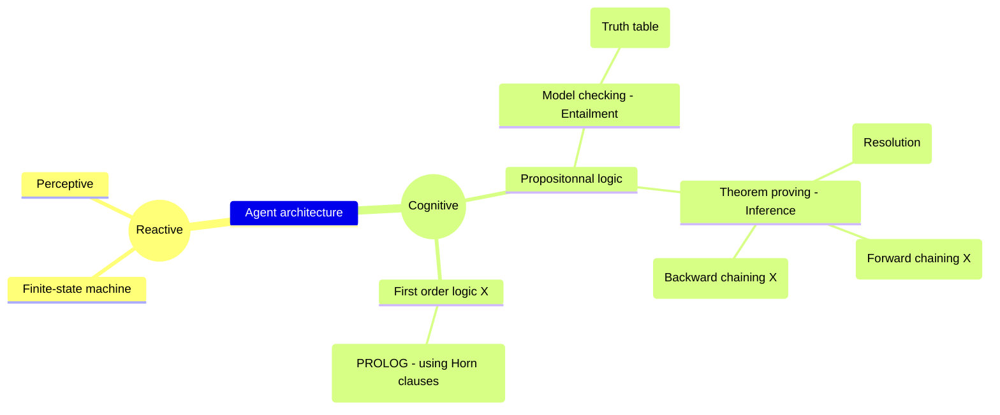

# Multi-agent systems
[Lien Moodle](https://moodle.umontpellier.fr/course/view.php?id=10070)

## Schéma récapitulatif

## Vocabulaire
Inference: process of deriving new facts from old ones.

Entailment: process of determining whether a given fact is true or false.

## Agent architecture
